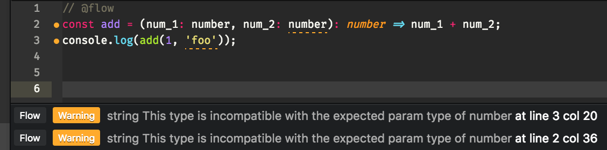

# Flowtype

----

# What is it?

##### Static type checker for catching bugs early as possible.

----

# How is it different from TypeScript?

Both options drive for the same result: catch errors early.

TypeScript is a superset of JS that gets compiled while Flowtype is just an additional tool (like ESLint) to validate variable types.

---

# Getting started

----

# Install

#### Install Flowtype

```bash
$ npm install --save-dev flow-bin
```

#### Install Babel

```bash
$ npm install -g babel-cli
```

#### Install Babel plugin for stripping out Flowtype annotations

```bash
$ npm install --save-dev babel-plugin-transform-flow-strip-types
```

----

# Configure

#### Create Flowtype configuration file

```bash
$ touch .flowconfig
```

#### Configure babel to strip out Flowtype annotations

```json
// .babelrc

{
  "plugins": ["transform-flow-strip-types"]
}
```

#### Setup npm scripts

```json
// package.json

{
  "scripts": {
    "flow": "flow check"
  }
}
```

----

# Running

#### On command line - either by hand or for example as Git _pre-commit_ hook.

```bash
$ npm run flow
```

#### In your editor/IDE - for example [https://atom.io/packages/linter-flow](https://atom.io/packages/linter-flow) with Atom.



---

# Adding your first type annotation

----

# Add Flowtype header

#### You need to tell Flowtype which files should be checked by adding special header in the beginning of the file. This allows you to add Flowtype to your project gradually.
```js
// @flow
```

#### You can also tell Flowtype to check all files, regardless of whether they have been marked or not.
```bash
$ npm run flow --all
```

#### However, this approach is not recommended especially if you are running Flowtype against project with many large third party frameworks or test suites. In cases like these, chances are that Flowtype finds a lot of errors that have nothing to do with your codebase.

----

# Simple example

```js
// @flow

// Function expects 2 numbers and returns one.
const add = (num_1: number, num_2: number): number => num_1 + num_2;
add(1, 'foo');
```

```bash
$ npm run flow

simple.js:5
  5: add(1, 'foo');
             ^^^ string. This type is incompatible with the expected param type of
  4: const add = (num_1: number, num_2: number): number => num_1 + num_2;
                                        ^^^^^^ number
```

----

# React component properties

```js
type Props = {
  message: string
}

const Error = (props: Props) => {
  return (
    <div>
      {props.message}
    </div>
  );
};

export default Error;

<Error message={true} />
```

```bash
$ npm run flow

Component.js:42
 42:       <Error message={true} />
                           ^^^^ React element `Error`
 42:       <Error message={true} />
                           ^^^^ boolean. This type is incompatible with
  9:   message: string
                ^^^^^^ string. See: Error.js:9
```

----

# Arrays

```js
// @flow

// Function expects array of numbers.
const count = (items: Array<number>): number => items.length;
count([1, 2, 'foo']);

```

```bash
$ npm run flow

array.js:5
  5: count([1, 2, 'foo']);
     ^^^^^^^^^^^^^^^^^^^^ function call
  5: count([1, 2, 'foo']);
                  ^^^^^ string. This type is incompatible with
  4: const count = (items: Array<number>): number => items.length;
                                 ^^^^^^ number
```

---

# Built-in types

```js
// Primitives
const isDeveloper: boolean = true;
const age: number = 31;
const name: string = "H-P";
const skills: null = null;
const doSomething = (): void => console.log("Did something!");

// any
const superArray: Array<any> = [1, "foo", true, null];

// Tuples
const tuple: [string, number] = ["foo", 1];

// Objects
const obj: { name: string, age: number } = { name: "H-P", age: 31 };

// Functions
const sum = (num_1: number, num_2: number): number => num_1 + num_2;
```

----

# Built-in types

```js
// Maybe
const maybeReturnName = (name: ?string): ?string => {
  // name is either string or null
  return name;
}

// Optional values
type IncompletePerson = {
  name: string,
  age?: number
}

const incompletePerson: IncompletePerson = { name: "H-P" }
```

---

# Extending Flowtype

In addition to built-in types, Flowtype can be extended with 3rd party or your own definitions.

----

# flow-typed

#### A central repository for Flow library definitions.

```bash
$ npm install -g flow-typed

$ cd /path/to/my/project
$ npm install
$ flow-typed install

Installing 1 libdefs...
  lodash_v4.x.x.js
    └> ./flow-typed/npm/lodash_v4.x.x.js
```

----

# Using flow-typed definitions

```js
// @flow
const _ = require('lodash');

// Adds two numbers.
_.add(1, 'foo');
```

```bash
$ npm run flow

lodash.js:5
  5: _.add(1, 'foo');
              ^^^^^ string. This type is incompatible with the expected param type of
307:     add(augend: number, addend: number): number;
                                     ^^^^^^ number. See lib: flow-typed/npm/lodash_v4.x.x.js:307
```

----

# Own type definitions

```js
// Type alias
type Person = {
  name: string,
  age: number,
  someRandomAttribute: string | number | Array<any>
}

const doSomething = (person: Person): Person => person;
doSomething({ name: "H-P", age: 31, someRandomAttribute: [1, 2, 3] });

// Generics
type Generic<T1, T2> = {
  name: T1,
  age: T2
}

const person: Generic<string, number> = { name: "H-P", age: 31 }
```

---

# Pros

* Flowtype has indeed greatly reduced the amount of runtime errors - probably won't start another project without it anymore.
* Quick and usually easy to integrate into existing projects.
  * Compared to TypeScript which might require more refactoring.
* Makes code more readable.

----

# Cons

* Atom integration not 100%: no proper plugin for autocompletion and showing definitions on hover.
* Not all popular libraries have type definitions, yet.
* Creating your own definitions can be tricky sometimes.

---

# Thanks!
